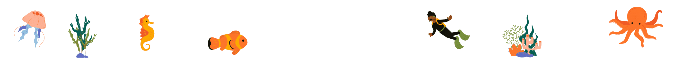

<p align="center">
  
</p>

<h1 align="center">Samskruthi 2K25</h1>
<p align="center">
  <b>Annual Intercollegiate Cultural Fest</b><br>
  <b>East Point College Campus</b><br>
  <b>24<sup>th</sup>, 25<sup>th</sup> and 26<sup>th</sup> April, 2025</b>
</p>
<p align="center">
  <i>Soak in the Hues of Joy</i>
</p>

---

## 🌊 About Samskruthi 2K25

Samskruthi 2K25 brings the magical world under the sea to life through a vibrant celebration of arts, music, dance, and creativity. This year's theme invites participants to explore the depths of cultural expression inspired by oceanic wonders. From coral reefs to mysterious deep-sea creatures, our events draw inspiration from the vast underwater world, creating a unique and immersive experience for all.

---

## 🚀 Features

- 🐠 **Animated Underwater Theme**: Immersive visuals with animated bubbles, waves, and sea creatures.
- 💻 **Modern UI**: Built with React, Vite, and Tailwind CSS for a fast and responsive experience.
- 🎉 **Interactive Sections**: Highlights, Gallery, Events, Registration, and more.
- 📱 **Mobile Friendly**: Optimized for all devices with custom mobile fixes.
- ⏳ **Preloader & Error Boundary**: Smooth loading experience and robust error handling.
- 📲 **Social Media Integration**: Instagram reels, YouTube, and more.
- 🤝 **Sponsor Showcase**: Animated sponsor logos and appreciation.

---

## 📸 Highlights

Relive the magical moments from our underwater cultural extravaganza through captivating [Instagram reels](https://www.instagram.com/samskruthi_2k25?igsh=MXJ5M2NkM3ZxNGhsNg==) and gallery images.

---

## 🖼️ Gallery

Have a glimpse of Samskruthi through our [Gallery](#gallery) section, featuring memories from previous years and the latest events.

---

## 📝 Registration

Ready to join?  
Register now to participate in our exciting underwater-themed cultural fest.  
[📄 Download Brochure](public/Samskruthi2K25.pdf) | [📝 Register for Events](https://docs.google.com/forms/d/e/1FAIpQLScN6fHnCzzfMKCgPN8kGM69_teFYU2bT6kqRJe3thnqECe6FQ/viewform?pli=1)

---

## 🤝 Sponsors

We thank our amazing sponsors for supporting Samskruthi 2K25!  
See the animated sponsor showcase in the [Sponsors](#sponsors) section.

---

## 🛠️ Tech Stack

<p align="center">
  
  
  
  
  
  
</p>

</p>

- **React**
- **Vite**
- **Tailwind CSS**
- **Framer Motion**
- **AOS (Animate On Scroll)**
- **Vercel Analytics**

---

## 📦 Project Structure

```
├── public/
│   ├── images/
│   ├── background_video/
│   └── Samskruthi2K25.pdf
├── src/
│   ├── components/
│   ├── assets/
│   ├── App.jsx
│   ├── main.jsx
│   └── index.css
├── tailwind.config.js
├── postcss.config.js
├── package.json
└── README.md
```

---

## 🚩 How to Run Locally

1. **Clone the repository**
   ```sh
   git clone <repo-url>
   cd Samskruthi_2k25
   ```

2. **Install dependencies**
   ```sh
   npm install
   ```

3. **Start the development server**
   ```sh
   npm run dev
   ```

4. **Open in browser**
   ```
   http://localhost:5173
   ```

---

## 📄 License

This project is for cultural and educational purposes.

---

## 🙏 Credits

<p align="center">
  Made with 💖 by Vaibhav Kumar.<br>
  (😎 Your friendly tech geek 😉)
</p>

---

<p align="center">
  
